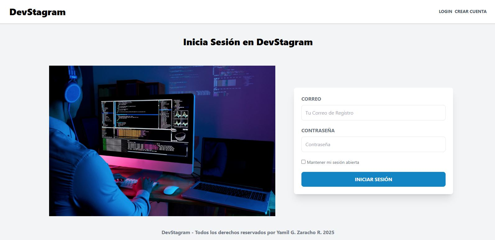
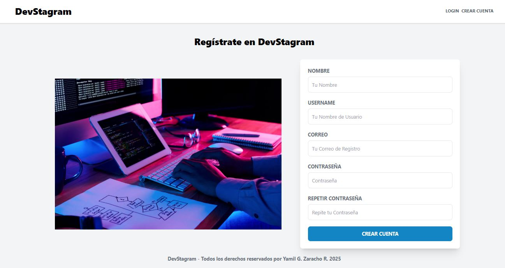
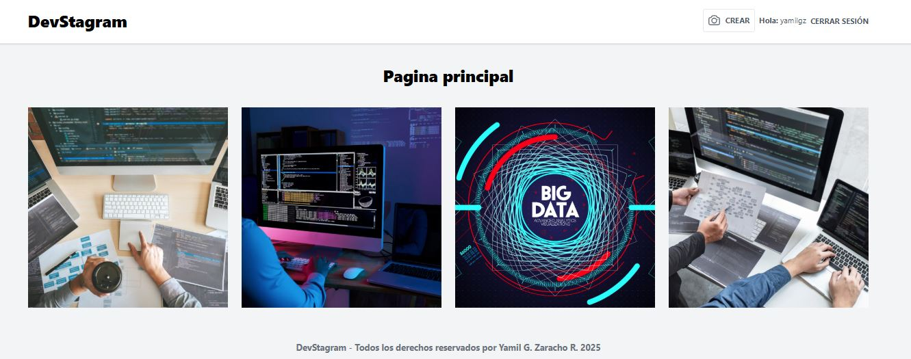
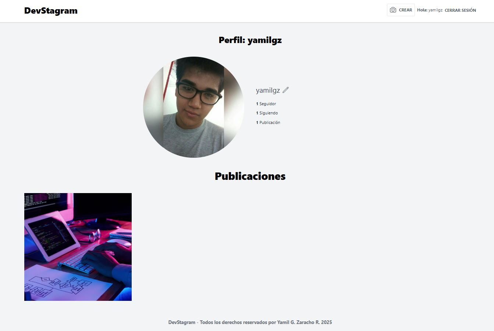
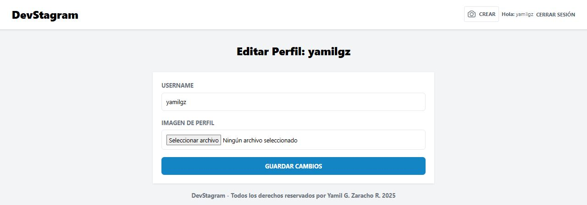
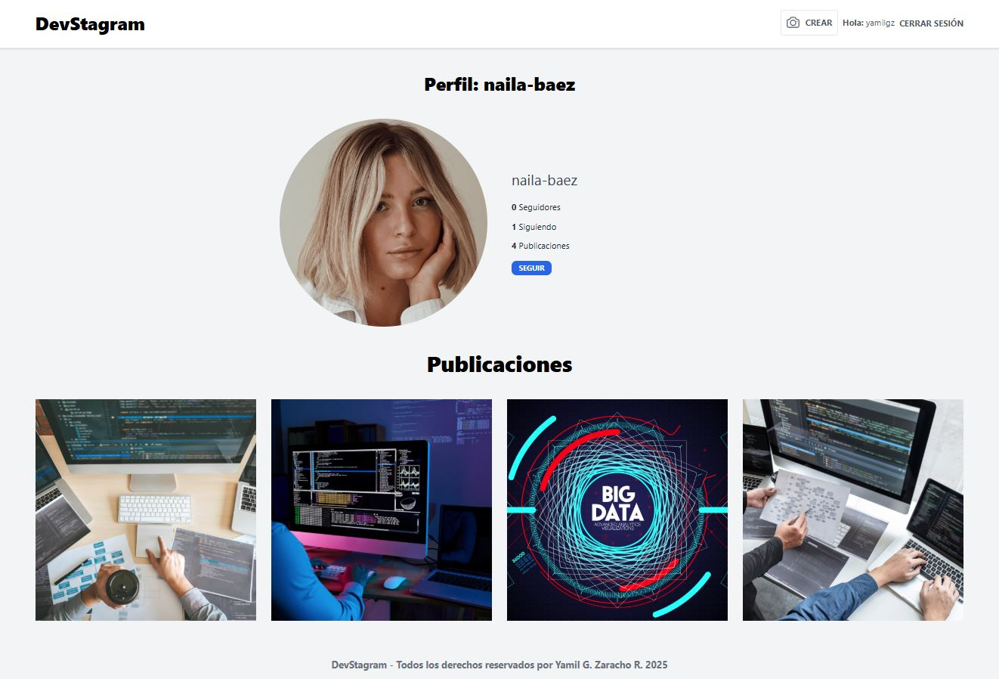

# 📸 Devstagram

Devstagram es una red social tipo Instagram construida con **Laravel**, donde los usuarios pueden registrarse, iniciar sesión, publicar imágenes y dar "likes" a otras publicaciones.

---

## 🚀 Tecnologías Utilizadas

- 🧬 PHP 8+
- ⚙️ Laravel 10/11
- 💾 MySQL o MariaDB
- 🖼️ Tailwind CSS
- ⚡ Livewire
- 🔐 Autenticación con Laravel Breeze o Jetstream
- 🧠 Eloquent ORM
- 📦 Composer y NPM

---

## 📋 Requisitos Previos

- PHP 8.1 o superior
- Composer
- Node.js y NPM
- MySQL o MariaDB
- Extensiones PHP necesarias (`pdo`, `mbstring`, `openssl`, etc.)

---

## 🖼️ Capturas de Pantalla

### 🔐 Página de Login


### 🔐 Página de Registro


### 🏠 Página principal


### 👤 Perfil de Usuario


### 👤 Configurar Usuario


### 👤 Perfil de otro Usuario para seguir


---

### ⚙️ Funcionalidades
- Registro e inicio de sesión de usuarios
- Creación de publicaciones con imágenes
- Sistema de "likes"
- Vistas dinámicas usando Livewire
- Validaciones personalizadas
- Panel de usuario con sus publicaciones

---

### 📁 Estructura del Proyecto (Resumen)
app/
├── Http/
│   ├── Controllers/
│   └── Livewire/
resources/
├── views/
├── css/
├── js/
routes/
└── web.php
.env.example
public/
database/

---

### 💡 Autor
Desarrollado por Yamil G. Zaracho R. (YamilGZ).

---

## 📥 Instalación y configuración

Sigue estos pasos para clonar y ejecutar el proyecto en tu entorno local:

```bash
# 1. Clona el repositorio
git clone https://github.com/YamilGZ/laravel-devstagram.git

cd laravel-devstagram

# 2. Instala dependencias de PHP
composer install

# 3. Instala dependencias de JavaScript/CSS
npm install && npm run dev

# 4. Copia el archivo de entorno y genera la clave
cp .env.example .env
php artisan key:generate

# 5. Configura la base de datos en el archivo .env
# DB_DATABASE=devstagram
# DB_USERNAME=tu_usuario
# DB_PASSWORD=tu_password

# 6. Ejecuta las migraciones
php artisan migrate

# 7. Inicia el servidor de desarrollo
php artisan serve.